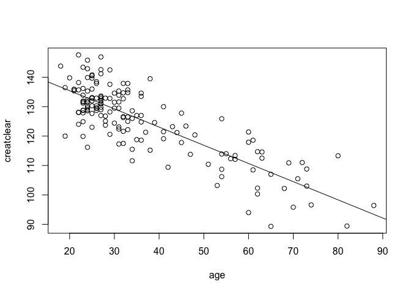

Timothy Gan, Randal Donaldson
================

## GitHub Documents

This is an R Markdown format used for publishing markdown documents to
GitHub. When you click the **Knit** button all R code chunks are run and
a markdown file (.md) suitable for publishing to GitHub is generated.

## ABIA

Look at these departure delays\!

<!-- --> \`\`\`

## Creatinine

muscle poop:

<!-- -->
