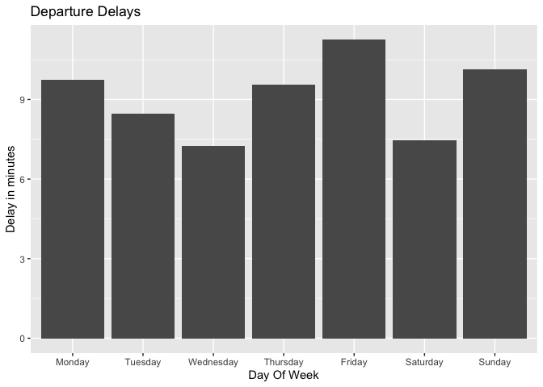
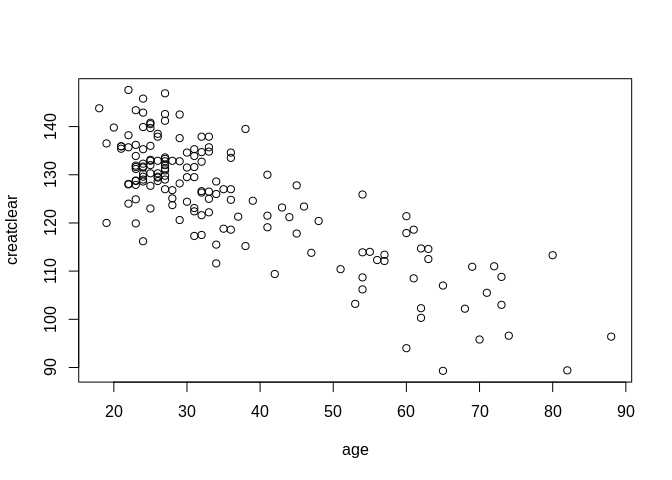
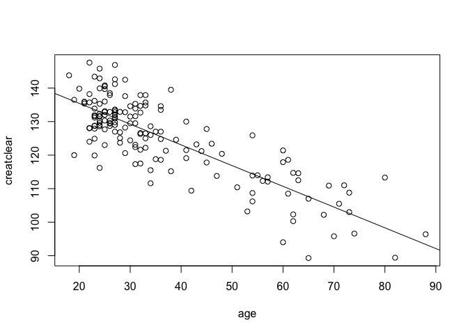

Timothy Gan, Randal Donaldson
================

## GitHub Documents

This is an R Markdown format used for publishing markdown documents to
GitHub. When you click the **Knit** button all R code chunks are run and
a markdown file (.md) suitable for publishing to GitHub is generated.

## ABIA

Look at these departure delays\!

<!-- --> \`\`\`

## Creatinine

Scatter plot of age vs creatinine clearance rate

<!-- -->

We found a first order polynomial to work fine, as a second order
polynomial looked pretty much like a straight line. A first order
regression gives us the equation:

creatclear = (age \* -.619) + 147.81
<!-- -->

We run the linear equation in R with x = 55 to predict the creatclear of
a 55 year old:

``` r
coef(lm1)[1] + 55*coef(lm1)[2]
```

    ## (Intercept) 
    ##     113.723

According to our linear regression, creatinine clearance decreases at a
rate of .619 mL/minute per year.
