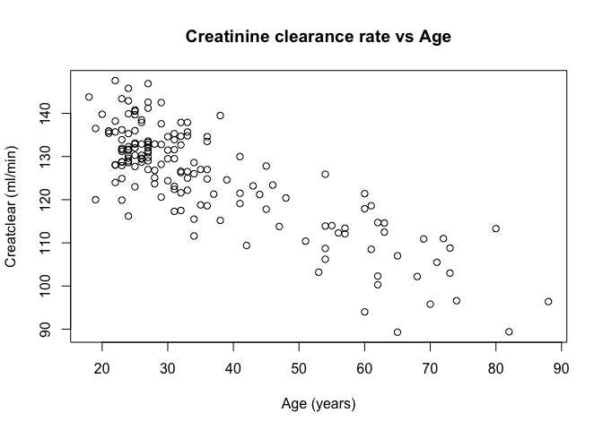
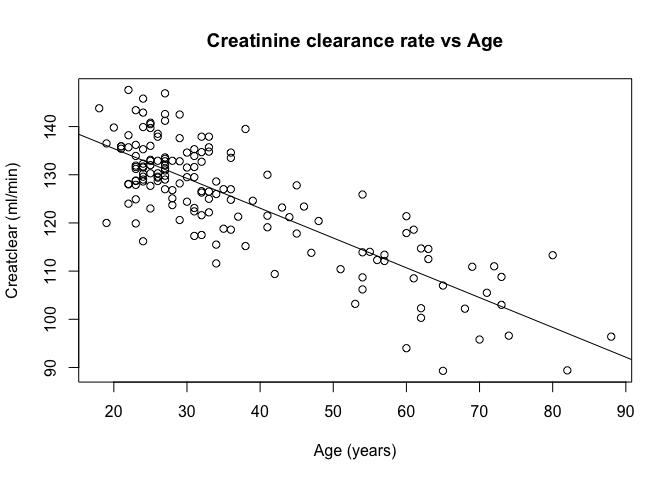
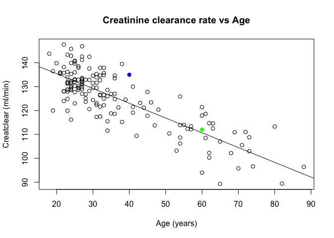
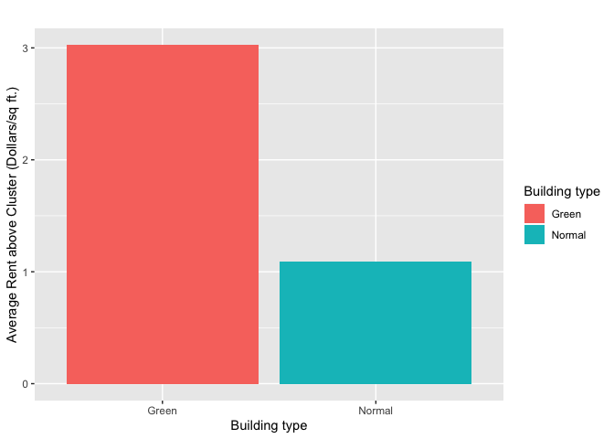
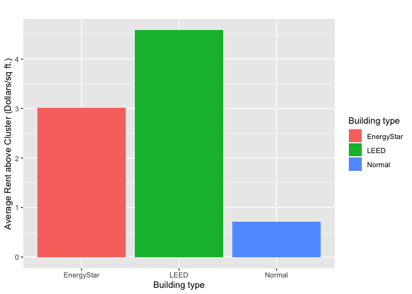
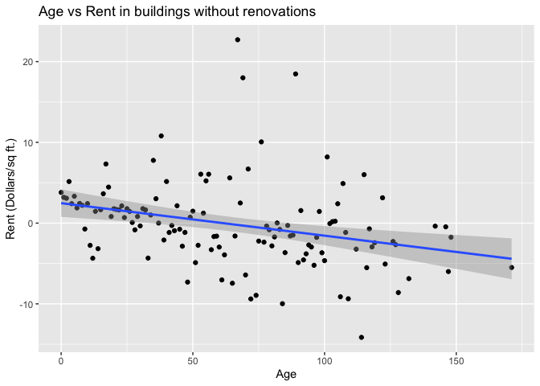
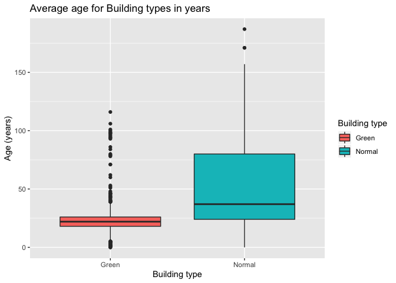
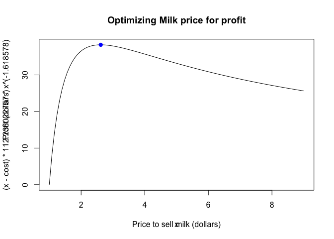

Timothy Gan, Randal Donaldson
================

## GitHub Documents

This is an R Markdown format used for publishing markdown documents to
GitHub. When you click the **Knit** button all R code chunks are run and
a markdown file (.md) suitable for publishing to GitHub is generated.

## ABIA

Look at these departure delays\!

<!-- --> \`\`\`

## Creatinine

Scatter plot of age vs creatinine clearance rate

<!-- -->

We found a first order polynomial to work fine, as a second order
polynomial looked pretty much like a straight line. A first order
regression gives us the equation:

creatclear = (age \* -.619) + 147.81

<!-- -->

We run the linear equation in R with \(x = 55\) to predict the
creatclear of a 55 year old:

``` r
coef(lm1)[1] + 55*coef(lm1)[2]
```

    ## (Intercept) 
    ##     113.723

According to our linear regression, creatinine clearance decreases at a
rate of .619 mL/minute per year.

<!-- -->

The blue point represents the 40 year old, and the green point
represents the 60 year old. As seen, the difference between the 40 year
old’s creatinine clearance and the predicted clearance for 40 year olds
is much higher than the difference between the 60 year old’s creatinine
clearance and the predicted clearance for 60 year olds.

## Green Buildings:

The Excel Guru failed to consider that green buildings may be
concentrated more in areas of lower or higher than average rent.

<!-- -->

When taking in to account difference between rent and average rent in
the surrounding area, the difference between greenbuildings and non
green buildings becomes smaller: from around 2.7 to 2.3-2.4 dollars per
square foot.

When only comparing buildings that are 15 stories the difference between
green and non green becomes even smaller:

15 story buildings

<!-- -->

The guru also failed to consider the difference in the types of green
certifications:

type comparison

<!-- -->

Assuming the costs to obtain LEED and EnergyStar certifications are
similar, it is clear that LEED is the way to go.

It also stands to reason that green buildings are going to be much newer
than non green buildings on average, and it would also stand to reason
that newer buildings would have higher rent in general than older
buildings regardless of green status

age vs rent

<!-- -->

Seen here, there is a slight negative correlation between age and rent
when buildings that have seen significant renovations are removed.

age + green

<!-- -->

As you can see, the vast majority of green buildings are 30 years or
younger, which would skew the average rent that the guru used to make
his calculations.

### Conclusion

If we use the same logic as the excel guru, but with the difference in
rent of just 15 story buildings (2 dollars per square foot) we still
find that the costs of green renovations should be recouped in about 10
years as opposed to 7.7, and likely even quicker if the new building
receives a LEED certification. Therefore, his overall assessment that a
green building would be profitable long term is probably correct, but
his method of determining this has some faults.

## Milk

As shown in class, N = (P - C) \* Q where N is net profit, P is price, C
is cost, and Q is quantity.

As for expressing Q in terms of P, we use the microeconomics equation
that uses power laws to represent changes in consumer demand as a
function of price: Q = KP<sup>PED</sup> where K is a constant and PED is
price elasticity of demand.

We can combine these equations to yield N = (P \* C) \* KP<sup>PED</sup>

In order to solve for all the constants, we can take the log of the
second equation, and use a linear regression to get those constants.

``` r
lm2 = lm(log(sales) ~ log(price), data = milk)
coef(lm2)
```

    ## (Intercept)  log(price) 
    ##    4.720604   -1.618578

PED is just going to be -1.618578, but the constant K is
***e***<sup>4.720604</sup> which happens to be 112.236022757. Given that
cost is 1, we can now find the optimal price for the most profit through
a few different ways. One is taking the derivative of the profit
equation and setting the derivative to 0. From there, we check the
points where the derivative is equal to 0 and find the maximum. We could
also plot it in R and eyeball it and zoom closer and closer to the
maximum. R also provides a really neat function to optimize an equation
given a certain domain. The third option is demonstrated below.

    ## $maximum
    ## [1] 2.616605
    ## 
    ## $objective
    ## [1] 38.24674

<!-- -->

The optimal price is $2.616605, and the max profit is $38.24674 given
the cost of milk is $1. To calculate p given a certain c, just set the
variable cost to whatever the cost of milk is.
